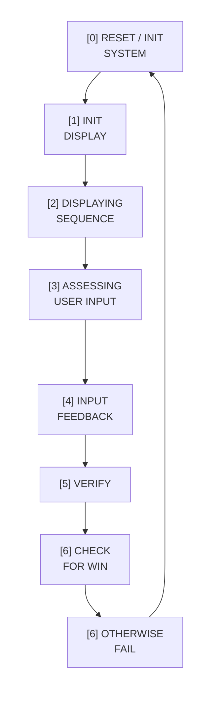

# Simon Says 🎵🟥🟩🟨🟦

Simon Says is a memory game written entirely in low-level **STUMP** assembly, running on a custom STUMP processor and peripheral board.

You’re shown an ever-growing sequence of coloured quadrants on the LED matrix, each paired with a distinct audio tone. Your task is to reproduce the sequence using the keypad. As levels increase, the sequence length grows, testing memory, timing, and precision.

> This repo contains my **COMP22111 Exercise 3** submission and demonstrates low-level embedded programming, memory-mapped I/O, and state-machine-driven game logic.

---

## Demo

**Gameplay demo (click to watch):**

---

## How the Game Works

- At the start of each round, the game **plays back a colour sequence** on the LED matrix.
- Each colour is paired with a **unique buzzer tone**.
- The sequence is stored internally and replayed deterministically.
- The player must **reproduce the sequence exactly** using the keypad.
- Input is checked **incrementally**:
  - Correct inputs advance the sequence index.
  - Any incorrect input immediately triggers a failure state.
- Each successful round **adds one new colour** to the sequence.
- The game supports **full reset and replay** after win or failure.

---

## Controls

All interaction uses the keypad:

- `1` – **Red** quadrant  
- `3` – **Green** quadrant  
- `9` – **Yellow** quadrant  
- `7` – **Blue** quadrant  
- **Any key** – Start / input  

---

## Project Structure

This repository follows the structure provided for the exercise:

- **`Exercise3/SimonSays.s`**  
  Main source file containing all game logic, state transitions, I/O handling, and animations.

---

## Main Game Logic

The core loop follows the execution cycle documented in the `GAME LOGIC` comments in `SimonSays.s`.

### Simon Says Execution Cycle

The game loop is split into numbered stages, matching the comments in `pixel_puzzel.s`.

### Stage Overview

#### [0] RESET / INIT
- Clears the LED matrix to black.
- If `LEVEL_COUNTER > 1`, clears the user/level position tables before continuing.
- Sets up initial variables and jumps into the appropriate init display:
  - Level 1 → animated “PIXEL / PUZZLE” intro + “PRESS ANY KEY”.
  - Level > 1 → simple LCD showing the current level number.

#### [1] INIT DISPLAY
- Uses the LCD to show either:
  - An animated title screen (`PIXEL` sweeps left → right, `PUZZLE` right → left), then a “PRESS ANY KEY” prompt, or
  - The current level number for levels 2+.
- Waits for a clean key press/release sequence before starting the level.

#### [2] DISPLAY LEVEL
- Uses the free-running counter (FRC) and a 6-bit mask to generate random indices `0–63`.
- Maps each index to an LED matrix address and the corresponding entry in the level table.
- Ensures no duplicates: if a slot is already `1`, it re-rolls.
- For each new pattern pixel:
  - Lights the matrix pixel red.
  - Plays a note via `SOUND_ADDR`.
  - Stores `1` in the corresponding `LEVEL_POSITIONS_TABLE` entry.
- After all pixels for this level have been shown, clears the matrix and jumps to input.

#### [3] ASSESSING USER INPUT
- Polls the keypad, debounces by waiting for it to return to zero.
- Decodes the key into:
  - Movement (up/down/left/right) → update cursor position.
  - Select (`5`) → toggle current cell in the user selection table and update colour.
  - Submit (`#`) → jump to verification (PASS/FAIL).

#### [4] DRAW PIXEL
- Moves the cursor within the defined bounds, guarding against leaving the 8×8 grid.
- Uses the `CHECK` routine and memory tables to:
  - Prevent recolouring a pixel that’s already selected when appropriate.
  - Ensure previous and current positions are tracked correctly.
- Writes the actual LED colour (white/red/black) to the matrix.

#### [5] VERIFY
- Maps the current cursor position into the correct row block (`POS_0–63`) using bound tables.
- Depending on whether the entry in the user table is `0` or `1`, control is sent to:
  - Add the selection to the table and paint red, or
  - Remove the selection and paint white.
- Uses a jump-table and “trampoline” branches to minimise duplicated movement logic.

#### [6] CHECK FOR WIN
- Compares all 64 entries of:
  - `SELECTED_POSITIONS_TABLE`
  - `LEVEL_POSITIONS_TABLE`
- If every entry matches:
  - Increments `LEVEL_COUNTER`.
  - Jumps back to `RESET` to start the next, harder level.

#### [6] OTHERWISE FAIL
- If any entry differs:
  - Correct selected pixels remain red.
  - Missed correct pixels (`SEL=0, LEV=1`) turn and stay green.
  - Extra selected pixels (`SEL=1, LEV=0`) repeatedly flash red ↔️ black.
  - The SW-LEDs display an “L” pattern to indicate loss.
- The game stays in this flashing state until **SW-D** is pressed.
- On hard reset:
  - `LEVEL_COUNTER` is set back to 1.
  - All position tables and peripherals are cleared.
  - Control jumps to `RESET` to restart from level 1.

### Implementation Highlights

- **Memory-mapped tables** for colours, addresses, keypad codes, positions and variables make the code data-driven and compact.
- **Jump tables** (for resets, near jumps and branch targets) let the program overwrite `PC` indirectly via `R7`, avoiding long chains of conditional branches.
- **Table-driven failure visualisation** handles all three cases (correct / missed / extra) by reading the `SEL` and `LEV` tables instead of hard-coding coordinates.
- Heavy reuse of **delay and movement routines** keeps the STUMP assembly reasonably small and maintainable for a feature-rich game.
